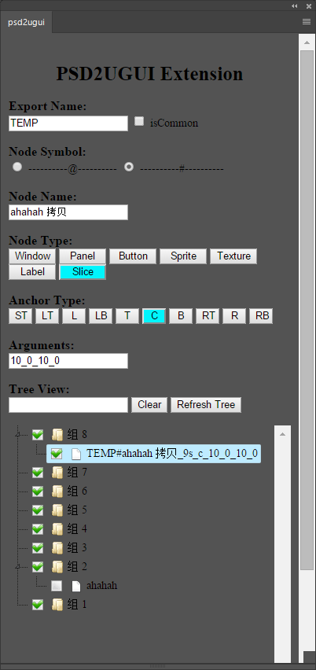

[TOC]

# 目前只支持Photoshop CC 2017

## 扩展工具简介

* 该扩展面板配合 [psd2ugui](https://github.com/tylearymf/psd2ugui) 使用，方便于开发者更便捷的修改psd中的节点和布局

## 界面样式

## 使用方法

* 下载并解压 release里面的 install.zip
* 双击 install.bat 安装 extension
* 重启 Photoshop，点击 “窗口 -> 扩展功能 -> psd2ugui” 即可

## 面板介绍

* 请参考 [psd2ugui README](https://github.com/tylearymf/psd2ugui/blob/master/README.md) 

